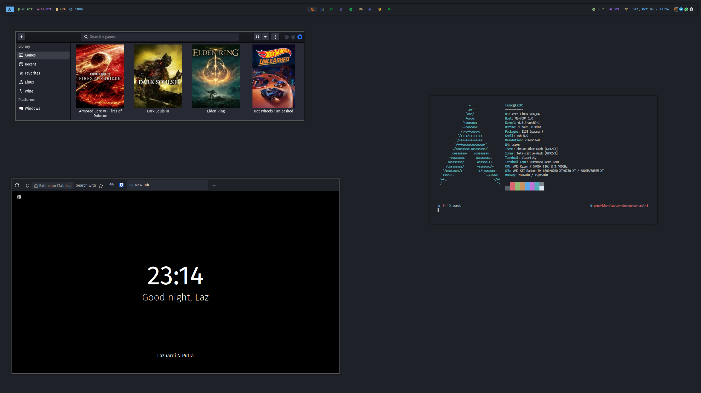

# dotfiles

Personal configuration files managed with [GNU Stow](https://www.gnu.org/software/stow/).
These configs power an Arch Linux desktop (Hyprland/bspwm) and macOS laptop, sharing a common cross-platform shell environment.

## Structure

```
.
├── all/          # Cross-platform — works on both Linux and macOS
├── linux/        # Linux-specific (WM, compositor, bar, notifications, etc.)
├── mac/          # macOS-specific
├── setup-arch.sh # Bootstrap script for Arch Linux
└── setup-mac.sh  # Bootstrap script for macOS
```

Each directory is a Stow package containing the exact filesystem tree relative to `$HOME`.
Running `stow -t ~ <package>` creates symlinks from `$HOME` into the repo.

### Packages

| Platform | Packages                                                                                                                                                                           |
| -------- | ---------------------------------------------------------------------------------------------------------------------------------------------------------------------------------- |
| **all**      | zsh, git, tmux, bat, starship, k9s, ai-agent, fonts, nvim                                                                                                                          |
| **linux**    | Hyprland, bspwm, waybar, rofi, polybar, alacritty, dunst, ly, pipewire, ranger, systemd, tofi, vivid, wallpaper, wireplumber, xremap, picom, swaylock, swappy, sxhkd, sunshine, utils |
| **mac**      | aerospace, sketchybar, alacritty, utils                                                                                                                                            |

### What's configured

- **zsh** — modular shell config (`env` / `alias` split), secrets isolation, starship prompt
- **git** — multi-profile setup (personal, work, autobahn) with conditional includes and LFS hooks
- **tmux** — status bar, keybinds, mouse support, persistent sessions via continuum/resurrect
- **starship** — custom prompt with git/K8s status, docker/python context
- **k9s** — Kubernetes TUI theme and keybind overrides
- **Shadowforce** — multi-agent AI system running on Claude Code and OpenCode Go. Six specialized agents (Overlord, Stalker, Engineer, Inquisitor, Seeker, Architect, Vanguard) with routing, supervision, and quality/security gates. Each agent runs on a different model optimized for its role (DeepSeek v4, Qwen, GLM, Mimo). Same team, same rules across both Claude and OpenCode runtimes.
- **Desktop (Linux)** — Hyprland (Wayland compositor) or bspwm (X11), waybar/polybar status bars, rofi launcher, dunst notifications, alacritty terminal, ly login manager, sunshine game streaming
- **nvim** — shared cross-platform editor config (`all/nvim`)
- **macOS** — aerospace tiling WM, sketchybar menu bar

## Prerequisites

- [GNU Stow](https://www.gnu.org/software/stow/)
- Git

## Installation

```bash
git clone git@github.com:laznp/dotfiles.git ~/Projects/personal/dotfiles
cd ~/Projects/personal/dotfiles

# Cross-platform configs
stow -t ~ -d all zsh git tmux bat starship k9s ai-agent nvim

# Linux desktop
stow -t ~ -d linux hyprland waybar rofi alacritty dunst ly

# macOS
stow -t ~ -d mac aerospace sketchybar alacritty
```

### Fresh install

```bash
# Arch Linux — installs system packages, AUR packages (via paru), and core tooling
./setup-arch.sh

# macOS — installs Homebrew and core tooling
./setup-mac.sh
```

## Secrets

Tokens and API keys (GitHub, Slack, Grafana, etc.) are stored in `~/.config/zsh/secrets`, which is excluded from git via `.gitignore`. The `.zshrc` sources it automatically:

```zsh
[ -f $HOME/.config/zsh/secrets ] && source $HOME/.config/zsh/secrets
```

Machine-specific PATHs and generated completions can go directly in `.zshrc` — only the secrets file is gitignored.

## Screenshots

